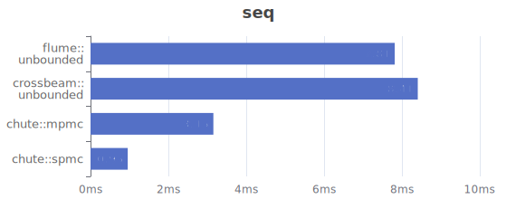
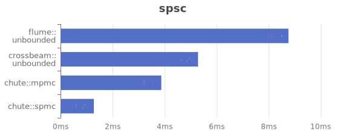
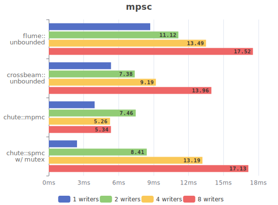

# chute

[](https://crates.io/crates/chute)
[](#license)
[](https://docs.rs/chute)
[](https://github.com/tower120/chute/actions/workflows/ci.yml)
[](https://codecov.io/github/tower120/chute)


An mpmc[^mpmc]/spmc[^spmc] lock-free multicast[^broadcast] queue.

[^mpmc]: Multi-producer multi-consumer.

[^spmc]: Single-producer multi-consumer.

[^broadcast]: Also known as a broadcast queue. Each consumer gets 
every message sent to queue, from the moment of subscription.

* Lock-free consumers without overhead[^lockfree_overhead].
* Mpmc lock-free producers, which write simultaneously.
* Spmc ordered. Mpmc ordered within writer messages[^mpsc_order].
* Unbounded dynamic size.
* Shared queue. All readers and writers use the same queue, without duplications.
* No clones! Messages are not cloned on return, so `Clone` is not required.

Blazingly fast reads. The consumer basically reads a plain slice of data, then 
does an atomic read that will define the next slice.

[^lockfree_overhead]: In compare to traditional lock techniques with Mutex.

[^mpsc_order]: This means that each message written by writer,
will be in the same order against each other. 
But between them, messages from other threads **may** appear.
If write calls will be synchronized - all messages will be ordered by that "synchronization order".

## Example

Write from multiple threads, read from multiple threads.

```rust
const WRITERS         : usize = 4;
const WRITER_MESSAGES : usize = 100;
const MESSAGES        : usize = WRITERS*WRITER_MESSAGES;
const READERS         : usize = 4;
let queue = chute::mpmc::Queue::new();

std::thread::scope(|s| {
    // READ threads
    for _ in 0..READERS {
        let mut reader = queue.reader();
        s.spawn(move || {
            let mut sum = 0;
            for _ in 0..MESSAGES {
                // Since this is a queue, not a channel - 
                // we just spin around next().
                let msg = loop {
                    if let Some(msg) = reader.next() {
                        break msg;
                    }
                };
                sum += msg;
            }
            
            assert_eq!(sum, (0..MESSAGES).sum());
        });
    }        
    
    // WRITE threads
    for t in 0..WRITERS {
        let mut writer = queue.writer();
        s.spawn(move || {
            for i in 0..WRITER_MESSAGES {
                writer.push(t*WRITER_MESSAGES + i);
            }             
        });
    }
});
```

## Benchmarks

Intel i4771 (3.5Ghz 4C/8T), DDR3 1600Mhz, Windows 10. See [benchmarks](benchmarks) sub-project.






Benchmarks compare with a channels since chute can be used +/- as a channel, by
spinning on the reader side.

P.S. _Suggestions on benchmark candidates are welcomed!_

## How it works

Chute is the next iteration of [rc_event_queue](https://crates.io/crates/rc_event_queue). The key difference is true lockless
mpmc writers. 

[See how it works.](doc/how_it_works.md)

## Test coverage

Library covered with fuzzy and [miri](https://github.com/rust-lang/miri) tests.

## Known limitations

* Currently, there is no way to "disconnect" slow reading reader from the writer side. 
The queue can grow indefinitely if at least one of the readers consumes slower
than writers fill it.

* All blocks have the same size now. This is likely to change in future -
it will probably work the same way as in [rc_event_queue](https://github.com/tower120/rc_event_queue/blob/HEAD/doc/principle-of-operation.md#dynamic-chunk-size). 